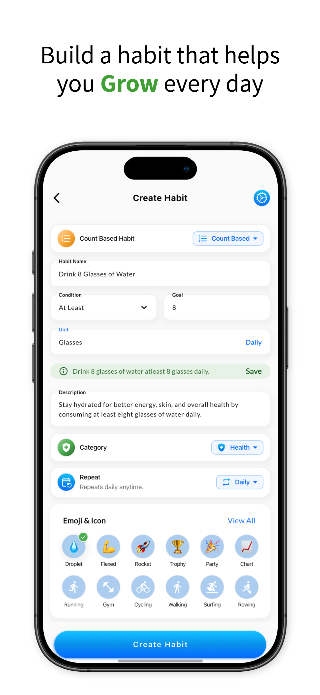
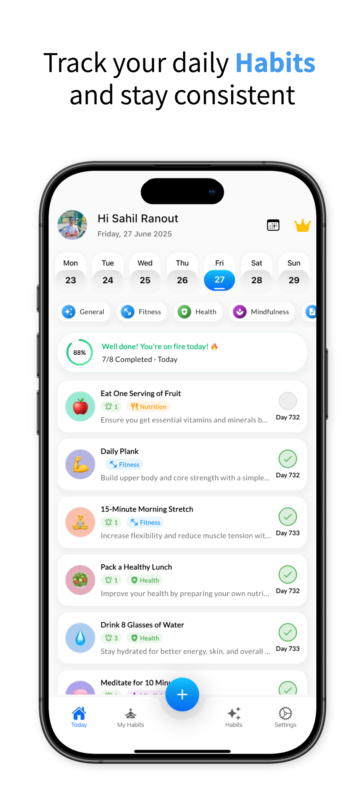
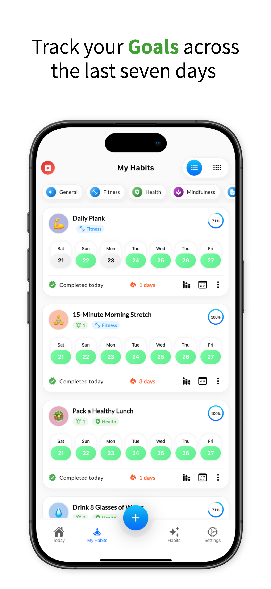
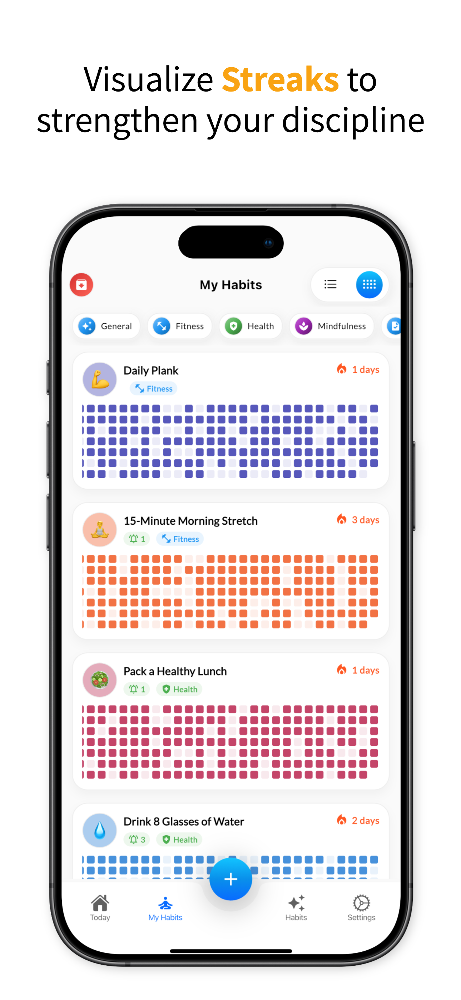

# 🌱 Habigrow - Habit Tracker & Goal Tracker App

## Build Habits That Help You Grow

**Your Personal Growth Companion for Building Better Habits, Achieving Goals & Understanding Your
Mood**

*Small habits, big results. Track your progress, achieve your goals, and grow every single day.*

[Features](#-what-makes-habigrow-special) • [Screenshots](#-see-habigrow-in-action) • [Download](#-get-habigrow-today) • [Learn More](#-learn-more)

---

## 🌟 Welcome to Habigrow - Where Habits Grow Into Success

**Build habits that help you grow with Habigrow** - the smart habit tracker that transforms your
daily routines into lifelong achievements. Whether you want to drink more water, exercise regularly,
read daily, meditate mindfully, or build any positive habit, Habigrow makes it simple, visual, and
incredibly motivating.

### Why Choose Habigrow?

**The habit tracker that actually works.** Thousands of people use Habigrow to build better habits,
achieve meaningful goals, and understand how their daily routines affect their mood and well-being.
It's not just another app—it's your personal growth companion that helps you:

- ✅ **Build consistent habits** that stick for life
- ✅ **Track meaningful goals** with clear progress
- ✅ **Understand your mood** and emotional patterns
- ✅ **See real results** with beautiful visual analytics
- ✅ **Stay motivated** with streaks and achievements

**Start your journey today** - [Download Habigrow for free](https://www.habigrow.com) and join
thousands who are already building better habits and achieving their goals.

---

## ✨ What Makes Habigrow Special - Features That Help You Grow

### 🎯 Track Any Habit Your Way - Four Flexible Tracking Methods

**Build habits that help you grow with Habigrow's flexible tracking system.** Every habit is unique,
and Habigrow understands that. That's why we offer four powerful ways to track your progress:

- **Simple Yes/No Habits** - Perfect for binary actions like "Wake up early", "No social media
  before bed", or "Take vitamins". Just mark done or skipped - simple and effective.

- **Count-Based Habits** - Track measurable quantities that matter. Monitor "8 glasses of water", "
  10,000 steps daily", "50 pushups", or "3 meals without sugar". See your numbers grow and feel the
  progress.

- **Time-Based Habits** - Monitor duration-based activities that build skills. Track "30 minutes of
  reading", "1 hour of exercise", "15 minutes of meditation", or "2 hours of deep work". Time well
  spent is progress well made.

- **Multi-Step Routines** - Create comprehensive checklists for complex habits. Build morning
  routines (Water → Stretch → Plan), evening rituals (Skincare → Reflect → No screen), or weekly
  planning sessions. Complete each step and watch your routine become automatic.

### 📊 See Your Progress Beautifully - Visual Analytics That Motivate

**Watch your consistency grow with stunning visual tools that make progress tangible.** Habigrow
transforms your habit data into beautiful, motivating visuals:

- **Calendar Heatmaps** - See your progress at a glance with colorful, GitHub-style calendars. Green
  days show consistency, patterns reveal your strong and weak periods, and the long-term view shows
  months of progress. Visual accountability that works.

- **Streak Tracking** - Stay motivated by maintaining your current streak and beating your longest
  streak. Every day counts, and seeing that number grow creates powerful psychological momentum.
  Don't break the chain - build it longer.

- **Progress Reports** - Get comprehensive weekly and monthly summaries of your achievements. See
  completion rates, identify your best-performing habits, and discover areas for improvement.
  Data-driven insights that guide your growth.

- **Trend Analysis** - Discover patterns in your behavior over time. Are you improving? Which habits
  stick best? What affects your consistency? Understanding trends helps you optimize your routine
  for maximum success.

### 🎯 Connect Habits to Your Goals - Link Actions to Achievements

**Set meaningful goals and link them to your daily habits.** Habigrow shows you exactly how your
small daily actions lead to big achievements. This powerful connection transforms abstract goals
into concrete daily actions:

- **SMART Goals Framework** - Set Specific, Measurable, Achievable, Relevant, and Time-bound goals.
  Want to lose 20 pounds? Link your exercise and nutrition habits. Want to learn Spanish? Track your
  daily practice sessions. Want to read 24 books this year? Connect your daily reading habit.

- **Automatic Progress Calculation** - See how your habits contribute to goal achievement
  automatically. Every completed habit moves you closer to your goal. Visual progress bars show
  you're on track, and milestone celebrations keep you motivated.

- **Goal-Habit Synergy** - When habits and goals work together, magic happens. Daily actions gain
  meaning, and long-term objectives become achievable. Build habits that help you grow with
  Habigrow's integrated system.

### 😊 Understand Your Mood - Discover How Habits Affect Well-Being

**One of Habigrow's unique features is mood tracking that reveals powerful insights.** See how your
habits affect how you feel, and build routines that truly improve your life:

- **Daily Mood Logging** - Record your emotional state each day with simple mood tracking. Rate your
  mood, add notes about what affected you, and build a comprehensive emotional journal over time.

- **Habit-Mood Correlation** - Discover powerful connections between your habits and well-being. You
  might find that days with exercise lead to better moods, meditation helps you feel more balanced,
  or adequate sleep improves your emotional resilience. Data reveals what works for you.

- **Wellness Insights** - Understand the connection between habits and mental health. Identify which
  habits boost your mood, recognize patterns and triggers, and optimize your routine for emotional
  wellness. Build habits that help you grow emotionally, not just physically.

### 🔔 Never Forget Again - Smart Reminders That Actually Work

**Smart reminders help you stay on track without being annoying.** Habigrow's intelligent
notification system learns your patterns and nudges you at the perfect time:

- **Customizable Notifications** - Set specific reminder times for each habit that fit your
  schedule. Morning habits get morning reminders, evening routines get evening prompts. Customize
  everything to match your lifestyle.

- **Smart Contextual Nudges** - The app learns your patterns and suggests optimal reminder times. If
  you always complete a habit at 7 PM, Habigrow will remind you around that time. Intelligent
  suggestions that adapt to you.

- **Flexible Frequency** - Set daily reminders, weekly prompts, or custom schedules. Some habits
  need multiple reminders per day (like hydration), others need just one (like morning meditation).
  Complete control over when and how you're reminded.

### ☁️ Your Data, Everywhere - Sync Seamlessly Across Devices

**Access your habits on your phone, tablet, or computer.** Habigrow syncs seamlessly across all your
devices, so you can check in wherever you are:

- **Real-Time Synchronization** - Changes appear instantly on all devices. Mark a habit complete on
  your phone, see it update on your tablet immediately. Seamless experience across platforms.

- **Secure Cloud Backup** - Your data is safely backed up to Google Drive with encryption. Never
  lose your progress, even if you switch devices. Automatic backups ensure your habit journey is
  always protected.

- **Offline Mode** - Track habits without internet, and changes sync when connection is restored.
  Full functionality offline means you never miss a day, even without connectivity.

### 🌍 Speak Your Language - Global Accessibility

**Habigrow speaks your language.** Available in **8 languages** with more coming soon: English,
Hindi, Arabic, Bengali, Chinese (Simplified), French, Russian, and Spanish. Build habits that help
you grow in the language you're most comfortable with.

---

## 🖼 See Habigrow in Action

<table>
  <tr>
    <td align="center" width="20%">
      
       <strong>Build Your Habits</strong>
       <small>Create and customize habits</small>
    </td>
    <td align="center" width="20%">
      
       <strong>Daily Habit Tracking</strong>
       <small>Track your daily progress</small>
    </td>
    <td align="center" width="20%">
      
       <strong>Habit Goals</strong>
       <small>Link habits to goals</small>
    </td>
    <td align="center" width="20%">
      
       <strong>Goal Progress</strong>
       <small>Monitor goal achievement</small>
    </td>
    <td align="center" width="20%">
      
       <strong>Streak Tracking</strong>
       <small>Visual streak tracking</small>
    </td>
  </tr>
</table>

---

## 📱 Get Habigrow Today

### Download for Free

Habigrow is available on all your favorite platforms. Download it today and start building better
habits.

**Android Users**  

**iPhone & iPad Users**  

**Web Users**  
Visit [habigrow.com](https://www.habigrow.com) to use Habigrow in your browser

---

## 💡 Why People Love Habigrow

### For Students

Students use Habigrow to build study routines, track revision schedules, and maintain focus habits.
It helps them stay organized and achieve academic
success. [Learn how students use Habigrow](https://www.habigrow.com).

### For Professionals

Busy professionals rely on Habigrow to optimize productivity, track skill development, and establish
consistent work routines. It's their secret weapon for career
growth. [See how professionals benefit](https://www.habigrow.com).

### For Fitness Enthusiasts

Fitness lovers use Habigrow to maintain exercise consistency, improve sleep patterns, and build
mindfulness practices. It keeps them accountable and
motivated. [Discover fitness tracking features](https://www.habigrow.com).

### For Everyone

Whether you're just starting your habit-building journey or you're a seasoned pro, Habigrow adapts
to your needs. Start simple and grow from
there. [Get started with Habigrow](https://www.habigrow.com).

---

## 🌱 Popular Habits People Track

### Health & Wellness

- Drink 8 glasses of water daily
- Walk 10,000 steps
- Exercise 3 times per week
- Get 8 hours of sleep

### Personal Growth

- Read for 30 minutes daily
- Learn a new skill
- Practice meditation
- Write in a journal

### Daily Life

- Morning routine checklist
- Evening wind-down routine
- Weekly meal planning
- Home organization tasks

### Mental Well-Being

- Daily gratitude practice
- Digital detox periods
- Mindfulness exercises
- Self-reflection time

---

## 🎨 Beautiful, Simple Design

Habigrow is designed to be beautiful and easy to use. The interface is clean and uncluttered, so you
can focus on what matters: building your habits. With smooth animations, intuitive navigation, and
dark mode support, using Habigrow is a joy.

---

## 🔒 Your Privacy Matters

Habigrow takes your privacy seriously. Your data belongs to you, and it always will. The app stores
your information securely, and you have complete control. Habigrow never sells your personal
information—ever. [Read our privacy policy](https://www.habigrow.com/privacy).

---

## ⭐ Unlock More with Premium

While Habigrow is free to use with all core features, Premium unlocks advanced capabilities:

- **Deeper Insights** - Get more detailed analytics about your habits
- **Unlimited Backups** - Never worry about losing your progress
- **AI-Powered Suggestions** - Get personalized habit recommendations
- **More Customization** - Themes, layouts, and advanced options
- **Ad-Free Experience** - Focus without distractions

---

## 🤝 Need Help?

Habigrow has a helpful support team ready to assist you. Whether you have questions about features,
need help getting started, or want to share feedback, they're here for you.

- **Help Center** - [support.habigrow.com](https://support.habigrow.com)
- **Community** - Join thousands of users sharing tips and success stories
- **Contact** - Reach out anytime at support@habigrow.com

---

## 📚 Learn More

Want to dive deeper? Check out these resources:

- [❓ Frequently Asked Questions](FAQ.md) - Get answers to common questions about Habigrow
- [Official Website](https://www.habigrow.com) - Complete documentation, tips, and habit-building
  strategies
- [Support Center](https://www.habigrow.com/support) - Help articles and guides

Visit [habigrow.com](https://www.habigrow.com) for the complete experience.

---

## 🌐 Connect with Habigrow

Join our community and stay updated with the latest tips, strategies, and inspiration for building
better habits.

### 📱 Official Channels

**Website** - Complete resources, documentation, and habit-building guides  
**Support** - Get help, report issues, and find answers to your questions

---

### 📲 Social Media

**Follow us** for daily habit tips, productivity insights, visual inspiration, and expert advice

---

### 💬 Community Platforms

**Join our communities** for discussions, habit challenges, peer support, and visual inspiration

---

### 📝 Content & Authority

**Read our content** - In-depth articles, expert insights, and weekly tips delivered to your inbox

---

### 🚀 Product & Launch

**Discover & Review** - Upvote on Product Hunt, contribute on GitHub, and share your experience on
app stores

---

## 🎯 Start Your Journey Today - Build Habits That Help You Grow

**Building better habits doesn't have to be hard.** With Habigrow, you have everything you need to
transform your life, one habit at a time. Small daily actions create massive long-term results.
Every streak you build, every goal you achieve, every mood you understand - it all starts with a
single habit.

### Why Wait? Your Future Self Will Thank You

**Download Habigrow now** and join thousands of people who are already building better habits and
achieving their goals. Every day you wait is a day you could be growing. Every habit you track is a
step toward the life you want.

**Build habits that help you grow with Habigrow** - where consistency meets achievement, where goals
meet daily actions, and where you meet your best self.

[Download for Android](#-get-habigrow-today) • [Download for iOS](#-get-habigrow-today) • [Visit Website](https://www.habigrow.com)

**Made with ❤️ to help you grow**

---

### 🌱 Habigrow - Build Habits That Help You Grow

*The habit tracker that helps you build the life you want, one day at a time.*  
*Small habits, big results. Track your progress, achieve your goals, and grow every single day.*

